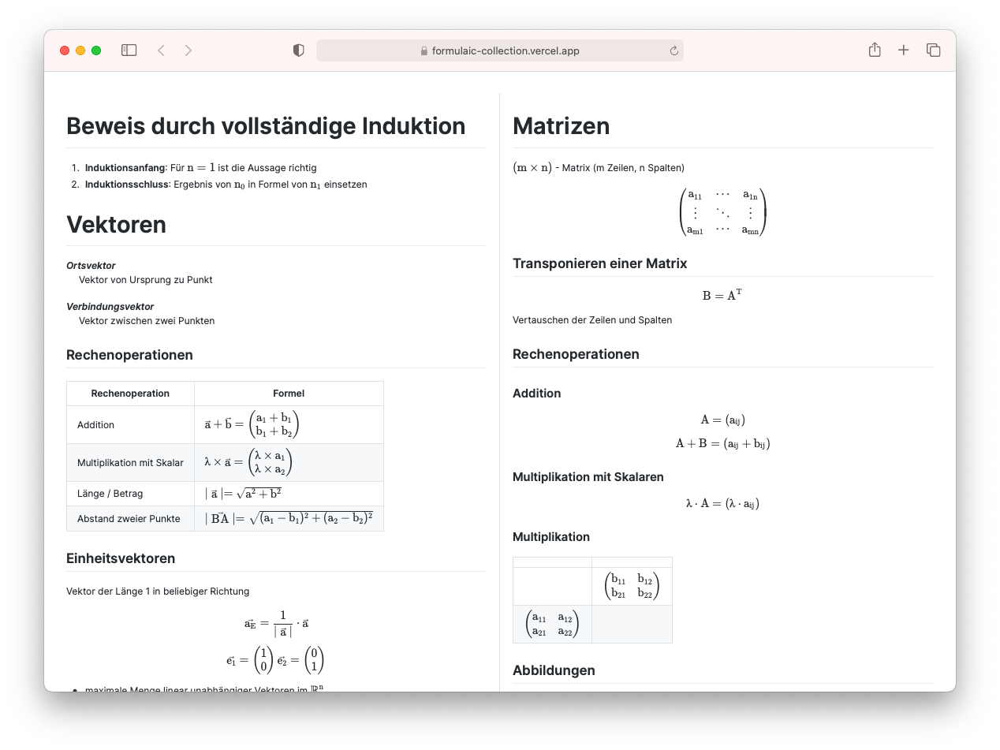

  

<h1 align="center">Formulary</h1>

    <strong>Math formula cheat sheet for an exam built on web technology.</strong>

  

This is the printer template of a math formula cheat sheet I (legally) used for
one of my linear algebra exams.

The individual topics of formulas are written out as `.md` files in the
`src/topics/` folder. They are imported as React components, which is made
possible by the `@mdx-js/rollup` plugin.

`remark-math` adds support for the LaTeX math syntax used in the markdown files.

 

## Screenshots

## Development

1. **Requirements**

   You need [Node.js](https://nodejs.org/en/) installed on your system.

2. **Install packages**

   Run `npm install` to install all neccesary packages.

3. **Run the application**

   Start the dev server by running `npm run dev`.
